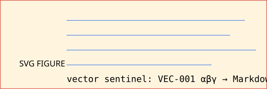
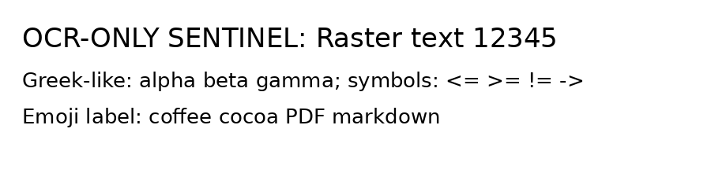
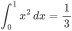

# CocoaPDF Strategic Corner Cases V1–V4

**Fixture contract:** this document intentionally combines common, adversarial, and future-scope cases. It is not a prose document; it is a deterministic test surface. Each section contains visible sentinel labels so conversion failures can be localized.

**Canonical package name:** CocoaPDF. The legacy `pdf2md` name may appear only as an import/CLI compatibility alias.

\[\[TOC source sentinel: a generated PDF may or may not create a real PDF outline/bookmark tree.\]\]

<a id="header-n7"></a>

---

## 1. Plain Text, Paragraphs, Spacing, and Line Joining

SENTINEL-TEXT-001: A simple paragraph should survive as one Markdown paragraph with normal spaces, punctuation, and sentence boundaries.

SENTINEL-TEXT-002: This paragraph contains deliberately irregular spacing, a non-breaking space between Cocoa PDF, a narrow no-break space in 12 345, and a thin space around A B. Normalize only where the converter policy explicitly allows it.

SENTINEL-TEXT-003: Soft line wrapping should be joined into one paragraph when the PDF visual line breaks are only layout artifacts. This sentence is intentionally long so that many PDF generators wrap it across several visual lines while the expected Markdown remains one paragraph.

SENTINEL-TEXT-004: Hard line breaks follow:  
first hard line  
second hard line  
third hard line

SENTINEL-TEXT-005: Hyphenated wrap target words: microservice, cooperate, reentry. Soft hyphen target: invisible soft hyphen.

SENTINEL-TEXT-006: Literal hyphenation that must not be repaired: state-of-the-art, end-to-end, mother-in-law, twenty-one, non-breaking hyphen A‑B.

SENTINEL-TEXT-007: Dotted leader line for TOC-like detection: Introduction . . . . . . . . . . . . . . . . . 7

---

## 2. Unicode, Encodings, Symbols, and Normalization

SENTINEL-UNICODE-001 Greek uppercase: Α Β Γ Δ Ε Ζ Η Θ Ι Κ Λ Μ Ν Ξ Ο Π Ρ Σ Τ Υ Φ Χ Ψ Ω.

SENTINEL-UNICODE-002 Greek lowercase: α β γ δ ε ζ η θ ι κ λ μ ν ξ ο π ρ σ τ υ φ χ ψ ω; variants: ς ϕ ϑ ϵ.

SENTINEL-UNICODE-003 Latin diacritics composed: café naïve façade coöperate São Tomé Łódź Ćevapi Ångström smörgåsbord.

SENTINEL-UNICODE-004 Latin diacritics decomposed: café naïve façade coöperate São Tomé Ångström.

SENTINEL-UNICODE-005 Ligatures and compatibility: fi fl ffi ffl ff; plain equivalents: fi fl ffi ffl ff; Roman numerals: Ⅰ Ⅱ Ⅲ Ⅳ Ⅴ Ⅹ.

SENTINEL-UNICODE-006 Math operators: ± × ÷ ≠ ≈ ≡ ≤ ≥ ∑ ∏ √ ∫ ∂ ∇ ∞ ∝ ∈ ∉ ∩ ∪ ⊂ ⊆ ⊕ ⊗ ∴ ∵.

SENTINEL-UNICODE-007 Arrows: ← ↑ → ↓ ↔ ↕ ⇒ ⇐ ⇔ ↦ ↩ ↪ ⟶ ⟵ ⟷.

SENTINEL-UNICODE-008 Currency and legal symbols: $ € £ ¥ ₹ ₿ ¢ ₩ ₪ ₽ © ® ™ § ¶ † ‡ №.

SENTINEL-UNICODE-009 Emoji single code points: 😀 😅 🚀 ☕ 🍫 📄 🧪 ✅ ❌ ⚠️.

SENTINEL-UNICODE-010 Emoji ZWJ and modifiers: 👩‍💻 🧑🏽‍🔬 👨‍👩‍👧‍👦 🏳️‍🌈 🇮🇳 🇺🇸.

SENTINEL-UNICODE-011 CJK: 中文测试 日本語テスト 한국어 테스트 漢字かなカナ.

SENTINEL-UNICODE-012 RTL visible text: עברית שלום עולם. العربية مرحبا بالعالم. Mixed LTR/RTL: ABC עברית 123 العربية XYZ.

SENTINEL-UNICODE-013 Indic and complex shaping: हिन्दी परीक्षण, বাংলা পরীক্ষা, தமிழ் சோதனை, తెలుగు పరీక్ష, ಕನ್ನಡ ಪರೀಕ್ಷೆ.

SENTINEL-UNICODE-014 Other scripts: Кириллица тест, Ελληνικά δοκιμή, Հայերեն փորձարկում, ქართული ტესტი, ไทยทดสอบ.

SENTINEL-UNICODE-015 Invisible/control-like characters named visibly: zero-width joiner \[‍\], zero-width non-joiner \[‌\], word joiner \[⁠\], left-to-right mark \[‎\], right-to-left mark \[‏\].

---

## 3. Markdown Escaping and Literal Characters

SENTINEL-ESCAPE-001: Literal Markdown metacharacters in prose: backslash \\ backtick \` asterisk \* underscore \_ braces {} brackets \[\] parentheses () hash # plus + minus - dot . exclamation ! pipe | angle ampersand &.

SENTINEL-ESCAPE-002: These should remain prose, not syntax: #notheading, -notlist, +notlist, *not emphasis*, *not emphasis*, 1.not ordered list.

SENTINEL-ESCAPE-003: Entity-looking text: © & © should not be double-decoded unexpectedly.

SENTINEL-ESCAPE-004: Literal HTML-looking text in code: `<div class="x">not active html</div>`.

---

## 4. Heading Hierarchy and Anchors

# H1 Duplicate Title Sentinel

## H2 Numbered and Plain

### H3 1.2.3 Numbered Heading

#### H4 With Bold and *Italic* Inline Source

##### H5 ALL CAPS HEADING

###### H6 Small Heading

## H2 Duplicate Title Sentinel

## H2 Duplicate Title Sentinel

<a id="explicit-anchor-v1-4"></a>

SENTINEL-ANCHOR-001: The explicit anchor target above should be available for internal link tests when the Markdown/PDF generator preserves anchors.

---

## 5. Inline Formatting

SENTINEL-INLINE-001: Plain, **bold**, *italic*, ***bold italic***, `inline_code()`, ~~strikethrough~~, <u>underline via HTML fallback</u>, <mark>highlight via HTML fallback</mark>.

SENTINEL-INLINE-002: Mixed styles inside one sentence: alpha **bravo *charlie* delta** echo `foxtrot_golf` hotel.

SENTINEL-INLINE-003: Superscript/subscript: H<sub>2</sub>O, CO<sub>2</sub>, x<sup>2</sup> + y<sup>2</sup> = z<sup>2</sup>, E = mc<sup>2</sup>.

SENTINEL-INLINE-004: Code span with punctuation: `a|b*c_d[0](x){y}`.

SENTINEL-INLINE-005: Backtick stress: ``code span containing ` one backtick`` and ```code span containing `` two backticks```.

SENTINEL-INLINE-006: Faux-style text that should stay plain if source PDF does not encode style: BOLDLOOKINGCAPS italic-looking-words code-looking_word.

---

## 6. Links, Destinations, and Security

SENTINEL-LINK-001: External link: [CocoaPDF external HTTPS](https://example.com/cocoapdf?alpha=1&beta=two#frag).

SENTINEL-LINK-002: Mail link: [Email maintainer](mailto:maintainer@example.com?subject=CocoaPDF%20fixture).

SENTINEL-LINK-003: Telephone link: [Call placeholder](tel:+15551234567).

SENTINEL-LINK-004: Internal link: [Jump to explicit anchor](#explicit-anchor-v1-4).

SENTINEL-LINK-005: URL with parentheses: [URL parentheses](https://example.com/a_(b)_c).

SENTINEL-LINK-006: Bare autolinks: <https://example.org/bare-url> and <mailto:bare@example.org>.

SENTINEL-LINK-SECURITY-001: Unsafe URI must be reported or rendered as plain text, not active: <u>unsafe javascript</u>.

SENTINEL-LINK-SECURITY-002: Unsafe file URI must be reported or rendered as plain text, not active: <u>unsafe local file</u>.

---

## 7. Lists and Nesting

SENTINEL-LIST-001 unordered list:

- alpha unordered item
- bravo unordered item with **bold** and `code`
- charlie unordered item that wraps in PDF because it contains a long explanation about list continuation, indentation, and visual
  line recovery across a layout-generated soft wrap.

SENTINEL-LIST-002 ordered list:

1. first ordered item
2. second ordered item
3. third ordered item

SENTINEL-LIST-003 ordered list starting at non-one:

7. item seven
8. item eight
9. item nine

SENTINEL-LIST-004 letter and roman markers source:

a. letter item source
b. second letter item source
iv. roman item source
v. second roman item source

SENTINEL-LIST-005 nested mixed list:

1. parent ordered alpha
   - child unordered alpha
   - child unordered bravo
     1. grandchild ordered one
     2. grandchild ordered two
2. parent ordered bravo
   1. child ordered one
      - deep bullet one
      - deep bullet two
   2. child ordered two

SENTINEL-LIST-006 task list source:

- [x] checked task item
- [ ] unchecked task item
- [x] uppercase checked task item

SENTINEL-LIST-007 singleton bullet that may be prose and should not be hallucinated as list without evidence:

• Singleton bullet-looking prose line.

SENTINEL-LIST-008 dash dialogue that should not become a list:  
— This is dialogue with an em dash.  
— This is another dialogue line.

---

## 8. Blockquotes

> SENTINEL-QUOTE-001 simple quote line one.
> simple quote line two with **bold** and `code`.
>
> SENTINEL-QUOTE-002 quote with list:
>
> - quoted bullet alpha
> - quoted bullet bravo
>
> 1. quoted ordered alpha
> 2. quoted ordered bravo
>
> SENTINEL-QUOTE-003 nested quote:
>
> > nested level two
>
> > > nested level three
>
> SENTINEL-QUOTE-004 quote with code:
>
> ```
> def quoted_code(x):
>  return x + 1
> ```

---

## 9. Code Blocks

SENTINEL-CODE-001 fenced Python:

```
def alpha(value: int) -> str:
	if value <= 0:
		return "zero-or-negative"
	return f"value={value}"
```

SENTINEL-CODE-002 blank lines, tabs, trailing-looking spaces:

```
line one

	line with leading tab
	line with four spaces
pipe | backtick ` asterisk * underscore _ brackets [] braces {}
```

SENTINEL-CODE-003 long code line:

```
abcdefghijklmnopqrstuvwxyzABCDEFGHIJKLMNOPQRSTUVWXYZ0123456789__abcdefghijklmnopqrstuvwxyzABCDEFGHIJKLMNOPQRST
UVWXYZ0123456789__END
```

SENTINEL-CODE-004 code block containing triple backticks:

````
```python
print("inner fenced block")
```
````

SENTINEL-CODE-005 HTML/XML code:

```
<section data-case="v1-4"><span>escaped & visible</span></section>
```

---

## 10. Horizontal Rules and Decorative Lines

SENTINEL-RULE-001 rule follows.

---

SENTINEL-RULE-002 text after rule. The line above is semantic thematic break, not a table border.

## Heading underline adversarial case

SENTINEL-RULE-003: The underline above may be rendered as Setext heading by Markdown generators; converter must avoid misclassifying unrelated table borders as thematic breaks.

---

## 11. Tables — GFM, Alignment, Escapes, and Borderless-Like Patterns

SENTINEL-TABLE-001 simple GFM table:

| Name | Qty | Price |
| --- | ---: | ---: |
| cocoa | 3 | 12.50 |
| PDF beans | 11 | 99.99 |
| escaped pipe | 1 | a \| b |

SENTINEL-TABLE-002 alignment table:

| Left aligned | Center aligned | Right aligned |
| --- | :---: | ---: |
| alpha | bravo | 123 |
| long wrapped cell text that may visually wrap in PDF | centered | 456.78 |

SENTINEL-TABLE-003 numeric and decimal alignment:

| Metric | 2024 | 2025 | Δ |
| --- | ---: | ---: | ---: |
| Revenue | 1,234.50 | 2,345.60 | +1,111.10 |
| Cost | -333.33 | -444.44 | -111.11 |
| Ratio | 0.125 | 0.875 | +0.750 |

SENTINEL-TABLE-004 table-like prose that must not become a table:

Alpha Bravo Charlie This is aligned prose, not a table, because it lacks repeated row semantics and it is a sentence-like paragraph.

SENTINEL-TABLE-005 key-value borderless table source:

| Field | Value |
| --- | --- |
| **Project** | CocoaPDF |
| **Scope** | structured text-layer PDFs |
| **Mode** | Markdown-first with HTML fallback |

---

## 12. Complex HTML Tables Requiring HTML Fallback

SENTINEL-HTML-TABLE-001 complex table:

<table>
<caption>Complex semantic table with spans, nested content, and code</caption>
<thead>
<tr><th rowspan="2">Component</th><th colspan="2">Evidence</th><th rowspan="2">Required output</th></tr>
<tr><th>Geometry</th><th>Semantic prior</th></tr>
</thead>
<tbody>
<tr><td>Heading</td><td>font size, gap, bold ratio</td><td>tagged H1–H6 when available</td><td>Markdown ATX heading</td></tr>
<tr><td>Complex cell</td><td colspan="2"><ul><li>nested list inside cell</li><li>inline <code>code()</code> inside cell</li><li>Unicode αβγ and emoji ☕</li></ul></td><td>HTML table fallback</td></tr>
<tr><td>Rowspan example</td><td rowspan="2">shared geometry evidence</td><td>first semantic row</td><td>preserve rowspan</td></tr>
<tr><td>Rowspan continuation</td><td>second semantic row</td><td>do not flatten silently</td></tr>
</tbody>
</table>

<a id="header-n255"></a>

---

## 13. Figures, Images, Captions, Floats, and SVG

SENTINEL-FIGURE-001 Markdown image with SVG data URI:

<figure class="cocoapdf-figure cocoapdf-align-center">

<figcaption>Figure 1. SVG vector figure with cocoa mark, blue lines, and visible vector sentinel text.</figcaption>
</figure>

<figure class="cocoapdf-figure cocoapdf-align-left">

<figcaption>Figure 2. HTML figure with explicit figcaption and vector source.</figcaption>
</figure>

SENTINEL-FIGURE-002 inline icon-like image should not destroy surrounding text:

<figure class="cocoapdf-figure cocoapdf-align-left">

</figure>

before-icon

after-icon.

SENTINEL-FIGURE-003 image wrapped in link:

<figure class="cocoapdf-figure cocoapdf-align-left">
<a href="https://example.com/linked-image" rel="noopener noreferrer"></a>
</figure>

---

## 14. OCR / Raster Hybrid Future Fixture

SENTINEL-OCR-001: The following image is intentionally raster text. V1/V2/V3 core without OCR should preserve it as an image or alt text, not hallucinate body text. V4 optional OCR may recover the raster text only when explicitly enabled and must report OCR provenance.

<figure class="cocoapdf-figure cocoapdf-align-center">

</figure>

Expected OCR-visible phrase if OCR is enabled: `OCR-ONLY SENTINEL: Raster text 12345`.

---

## 15. Footnotes and Endnotes

SENTINEL-FOOTNOTE-001: This sentence has a numeric footnote. [^1] This sentence has another note with Unicode. [^2]

SENTINEL-FOOTNOTE-002: Multiple references to one definition may occur. [^1]

## Endnotes

\[EN1\] SENTINEL-ENDNOTE-001: Endnote-style paragraph that resembles a bibliography entry but is not a citation.

---

## 16. Table of Contents, Cross-References, and Bibliography

## Contents

- [Plain Text, Paragraphs, Spacing, and Line Joining](#header-n7)
- <u>Tables</u>
- [Figures](#header-n255)

SENTINEL-CROSSREF-001: See Figure 1, Figure 2, Table 1, Section 11, Appendix A, Equation (1), and reference [\[1\]](#ref-1).

## References

<a id="ref-1"></a>[1] Doe, Jane. “A Synthetic PDF Benchmark.” Journal of Deterministic Documents, 2026. DOI: 10.0000/cocoapdf.0001.

<a id="ref-2"></a>[2] Smith, John and Roe, Alex. *Tables Without Borders*. Example Press, 2025. <https://example.com/references/2>.

Doe, J. (2024). Author-year reference style with hanging indentation expectation. Example Journal, 12(3), 45–67.

---

## 17. Math and Formula Fallback

SENTINEL-MATH-001 inline math-like text: E = mc², a² + b² = c², ∑ᵢ xᵢ = 42.

SENTINEL-MATH-002 display formula source:

<figure class="cocoapdf-figure cocoapdf-align-center">

</figure>

SENTINEL-MATH-003 Unicode formula:

∀x ∈ ℝ, ∃y ∈ ℝ such that y² = x when x ≥ 0.

SENTINEL-MATH-004 matrix-like text:

| Formula | Meaning |
| --- | --- |
| `A = [[1, 2], [3, 4]]` | matrix literal |
| `det(A) = -2` | determinant |

---

## 18. Multi-Column, Sidebars, Callouts, and Floats via HTML/CSS

<div class="cocoapdf-columns" style="columns: 2; column-gap: 2rem; border-left: 4px solid #d63a2b; padding-left: 0.9rem;">
<p><strong>SENTINEL-COLUMNS-001 left/right flow:</strong> Column content alpha begins here. It should be read in column order when the PDF physically lays it out in columns.</p>
<p>Column content bravo contains Greek αβγ and numbers 12345.</p>
<p>Column content charlie contains a link-like visible string https://example.com/columns.</p>
<p>Column content delta ends the multi-column region.</p>
</div>

<div style="border: 1px solid #9bb7d3; background: #eef6ff; padding: 12px;"><strong>SENTINEL-CALLOUT-001:</strong> This is an HTML callout/sidebar. Markdown cannot represent this exactly; CocoaPDF should use safe HTML fallback or report a callout region.</div>

---

## 19. Forms and Annotations Future Fixture

SENTINEL-FORM-001 visible form-like text:

<div class="cocoapdf-form-appearance" data-cocoapdf-kind="printed">
<label>Name: <input type="text" value="Cocoa Tester" disabled /></label>

<label><input type="checkbox" checked disabled /> checked checkbox visible label</label>

<label><input type="checkbox" disabled /> unchecked checkbox visible label</label>

<select disabled>
  <option selected>bravo selected</option>
</select>
</div>

SENTINEL-ANNOTATION-001: Highlight, underline, strikeout, sticky-note, stamp, and file-attachment annotations require PDF-level fixture construction. This Markdown source includes visible labels only; annotation dictionaries should be added by a PDF fixture generator for V2.12/V3 tests.

---

## 20. Active Content and Security Future Fixture

SENTINEL-SECURITY-001: Generated PDFs for this section may be post-processed to inject `/OpenAction`, `/AA`, `/JavaScript`, `/Launch`, `/RichMedia`, remote `/GoToR`, and embedded-file actions. CocoaPDF must detect and report these without executing, fetching, launching, or submitting anything.

SENTINEL-SECURITY-002: Visible unsafe strings: javascript:alert(1), file:///tmp/secret.txt, data:text/html;base64,SGVsbG8=.

---

## 21. Page Breaks, Furniture, Headers, Footers

SENTINEL-PAGE-001: The generator may insert page numbers and running headers/footers. CocoaPDF must remove repeated furniture only with repeated-page evidence and must never drop body text.

SENTINEL-PAGE-002: New page marker after explicit page break. If a PDF generator honors the break, this starts a new page.

Running header text candidate: CocoaPDF Fixture Header Running footer text candidate: Page N Footer

---

## 22. Damaged, Encrypted, and Hard-PDF V3 Matrix Labels

SENTINEL-V3-001: This source cannot itself create malformed xrefs, object streams, encrypted streams, corrupted filters, or damaged trailers. Create derivative PDFs from this generated PDF for V3 tests:

- V3-A: object streams and xref streams
- V3-B: incremental update overriding old objects
- V3-C: empty-password RC4/AES encrypted copy
- V3-D: damaged xref requiring recovery scan
- V3-E: missing or lying `/Length`
- V3-F: no-ToUnicode symbolic font
- V3-G: CJK/RTL/vertical-writing focused pages
- V3-H: decompression bomb guard fixture

---

## 23. Final Kitchen Sink Paragraph

SENTINEL-FINAL-001: CocoaPDF final mixed paragraph contains **bold αβγ**, *italic* 中文, `code_with_pipe|and_backtick`, a link to [HTTPS](https://example.com/final), superscript x<sup>2</sup>, subscript H<sub>2</sub>O, emoji ☕🚀, currency €₹₿, RTL עברית العربية, and escaped markdown characters \\ \` \* \_ \[ \] ( ) # + - . ! |.

---

## Appendix A — Expected Comparison Notes

- V1/V2 Markdown-first output may preserve complex sections as safe HTML fallback.
- V3 hard-PDF cases require derivative PDFs created after this source PDF is generated.
- V4 OCR is optional and must be disabled by default; when enabled, OCR text must carry provenance and confidence.
- Unsafe links/actions must never remain active in HTML output.
- Structural false positives are worse than plain-text fallback.

[^1]: Footnote definition one. It includes a URL <https://example.com/footnote>, punctuation, and continuation text.

[^2]: Footnote with Greek αβγ, emoji ☕, and CJK 中文.
